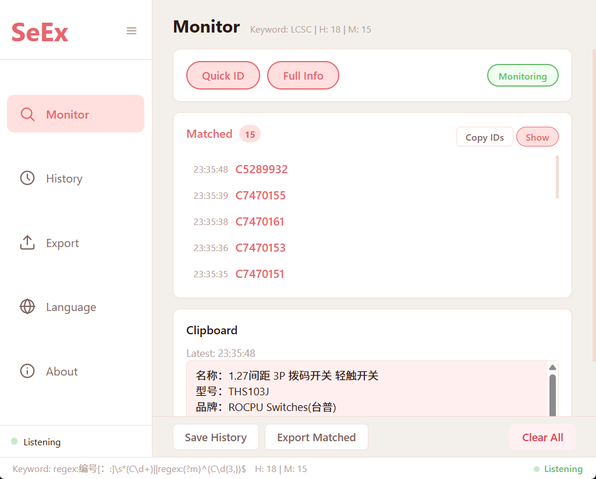
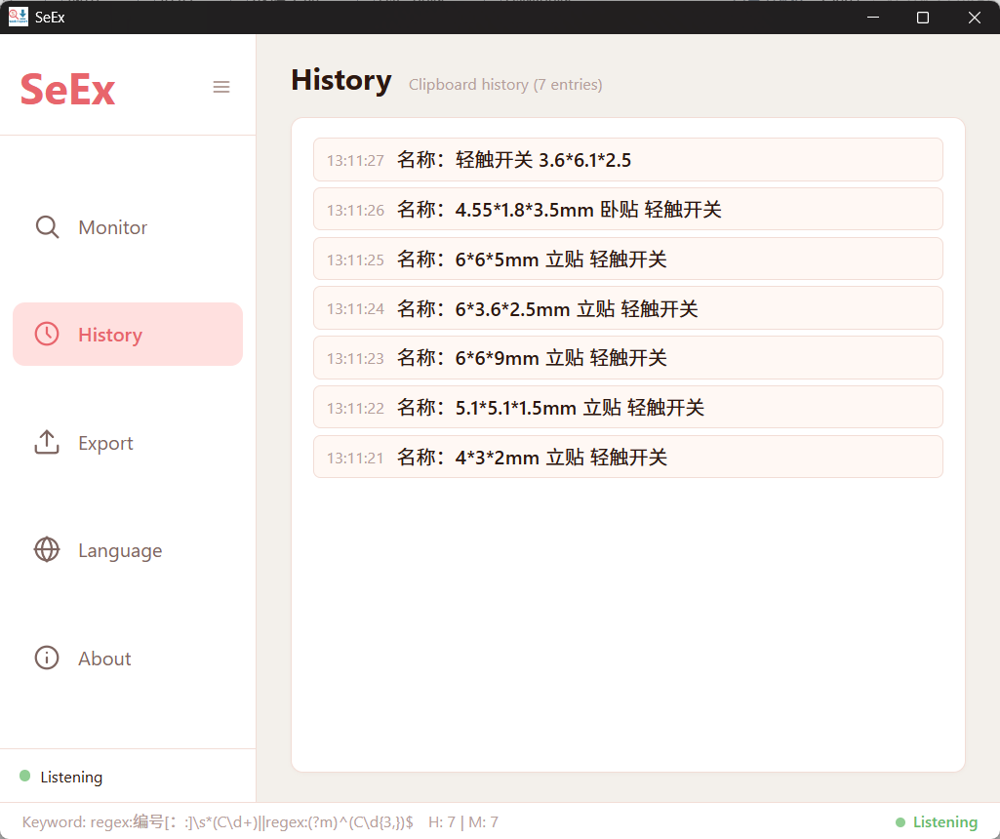
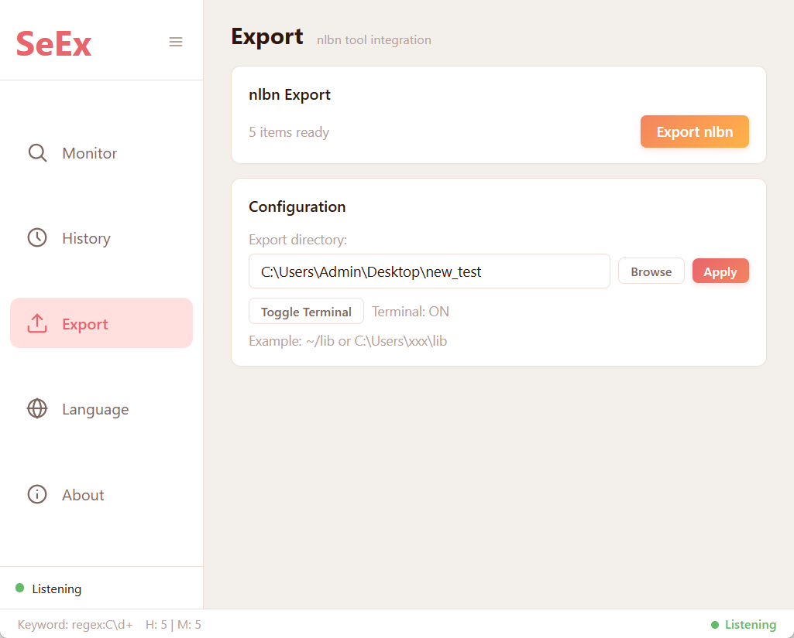
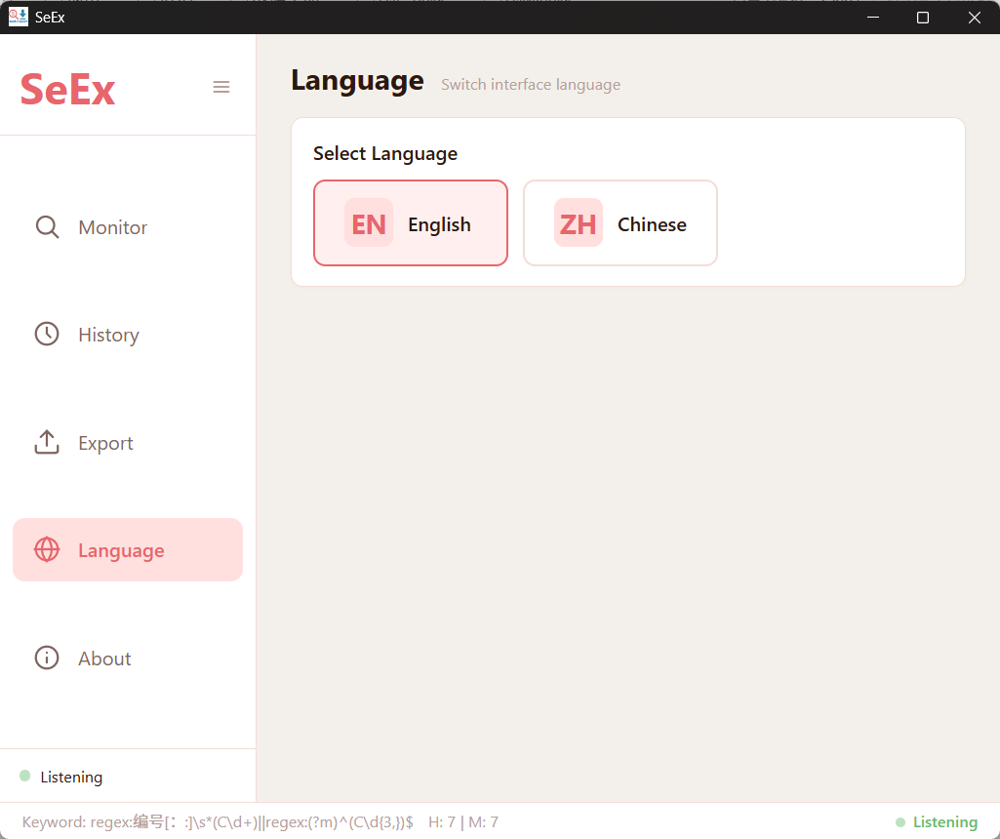
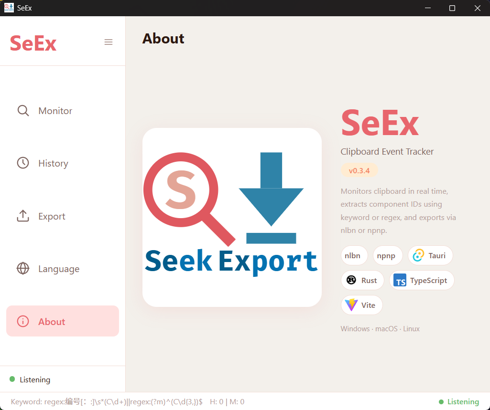

<p align="center">
  
</p>

<h1 align="center">SeEx</h1>

<p align="center">
  <strong>Seek &amp; Export</strong> — Clipboard Event Tracker
</p>

<p align="center">
  
  
  
</p>

---

## What is SeEx?

SeEx monitors your clipboard in real time, extracts component IDs (e.g. LCSC C-codes) using smart pattern matching, and exports matched results via the **nlbn** tool. Built for electronics engineers working with component databases.

---

## How to Use

### 1. Monitor — Match component IDs from clipboard

<p align="center">
  
</p>

The **Monitor** page is where the magic happens:

- **Quick ID** — Toggle this to match when you directly copy a bare component ID like `C7470135`.
- **Full Info** — Toggle this to extract the C-code when you copy a full component info block containing `编号：C7470135`.
- **Monitoring** — Green means active. Click to pause/resume clipboard monitoring.
- Both **Quick ID** and **Full Info** can be enabled at the same time, so every copy is covered.
- **Matched** panel shows all unique extracted IDs with timestamps. Use **Copy IDs** to copy them all, or click **Copy** on individual items.
- **Clipboard** panel previews the latest copied content.
- **Save History** / **Export Matched** / **Clear All** buttons are pinned at the bottom.

> **Tip:** Duplicate IDs are automatically filtered — copying the same component multiple times won't create duplicates.

---

### 2. History — View all clipboard activity

<p align="center">
  
</p>

The **History** page shows every clipboard entry captured while monitoring is active. Each entry shows the timestamp and a preview of the copied content. You can **Copy** or **Delete** individual entries. Up to 50 entries are stored.

---

### 3. Export — Batch export via nlbn

<p align="center">
  
</p>

The **Export** page integrates with the **nlbn** command-line tool:

- Set the **export directory** by typing a path or clicking **Browse**.
- Click **Apply** to save the path.
- **Toggle Terminal** switches between opening a terminal window (to see nlbn output) or running silently in the background.
- Click **Export nlbn** to batch-export all matched component IDs.

> **Note:** The `nlbn` tool must be installed and available in your system PATH.

---

### 4. Language — Switch between English and Chinese

<p align="center">
  
</p>

Click **English** or **中文** to switch the entire interface language. When Chinese is selected, the embedded **Source Han Sans** font is used for consistent rendering across all platforms. Your preference is saved and remembered.

---

### 5. About

<p align="center">
  
</p>

The **About** page shows app info, version, and the tech stack. Click on any technology icon to visit its website.

---

## Tech Stack

| | Technology | Role |
|---|---|---|
|  | [Tauri](https://tauri.app) | App framework |
|  | [Rust](https://www.rust-lang.org) | Backend logic |
|  | [TypeScript](https://www.typescriptlang.org) | Frontend logic |
|  | [Vite](https://vite.dev) | Build tooling |

## Getting Started

### Prerequisites

- [Rust](https://rustup.rs/) (stable)
- [Node.js](https://nodejs.org/) (v18+)
- [Tauri CLI](https://tauri.app/start/)

### Development

```bash
npm install
npx tauri dev
```

### Build

```bash
npx tauri build
```

Installers are generated at:
- **Windows**: `src-tauri/target/release/bundle/msi/seex_0.1.0_x64_en-US.msi`
- **Windows**: `src-tauri/target/release/bundle/nsis/seex_0.1.0_x64-setup.exe`
- **macOS**: `.dmg` (via GitHub Actions)
- **Linux**: `.deb` / `.AppImage` (via GitHub Actions)

## License

This project is licensed under [CC BY-NC 4.0](https://creativecommons.org/licenses/by-nc/4.0/).

Free to use, share, and adapt for non-commercial purposes with attribution.
